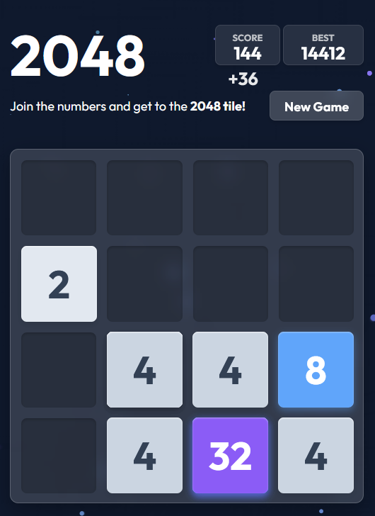

# 2048 - Tetris Effect Style Fork



## About this Fork

This version is a custom fork by **Cheycron**. It's a reinterpretation aiming to make 2048, my favorite game, much more "reactive" and synergistic with the user's controls.

Inspired by audiovisual experiences like *Tetris Effect*, this fork includes completely dependency-free, vanilla JavaScript enhancements:

- **Reactive Audio:** A dynamic, procedural synthesizer built purely with the Web Audio API. It emits ambient drones that start on your first interaction, sound blips that change pitch based on the direction you move, and rich chords and arpeggios that scale in intensity and complexity depending on the value of the merged tiles.
- **Immersive Visuals:** An interactively dynamic background `Canvas` that flashes light on big merges and draws shooting stars (particles) that physically react to the "wind" direction of your keyboard inputs.
- **More Intense Animations:** Direct styling modifications to the base SCSS to exponentially increase the visual impact, scale, and glowing drop-shadows of high-value tiles bursting onto the board.

The goal is to turn a methodical puzzle game into a rhythmic, sensory, and rewarding experience without relying on external game engines or heavy media files.

> **Fun Fact:** The hardest part of developing this wasn't the coding challenges, but rather trying not to get stuck playing it during every single debug session because it became so incredibly addictive!

---

## Original Project

This project is a fork of Gabriele Cirulli's original 2048.

A small clone of [1024](https://play.google.com/store/apps/details?id=com.veewo.a1024), based on [Saming's 2048](http://saming.fr/p/2048/) (also a clone). 2048 was indirectly inspired by [Threes](https://asherv.com/threes/).

Made just for fun. [Play the original here!](http://gabrielecirulli.github.io/2048/)

The official app can also be found on the [Play Store](https://play.google.com/store/apps/details?id=com.gabrielecirulli.app2048) and [App Store!](https://itunes.apple.com/us/app/2048-by-gabriele-cirulli/id868076805)

2048 is licensed under the [MIT license.](https://github.com/gabrielecirulli/2048/blob/master/LICENSE.txt)

---

## 📦 Deployment

To package the entire game (HTML, CSS, JS) into a single portable file for easy deployment:

```bash
npm run bundle
```

This generates `index-bundled.html` - a standalone file ready to upload anywhere.

**Available commands:**
- `npm run bundle` - Standard bundle (readable code)
- `npm run bundle:min` - Minified bundle (smaller file size)
- `npm run bundle:all` - Generate both versions
